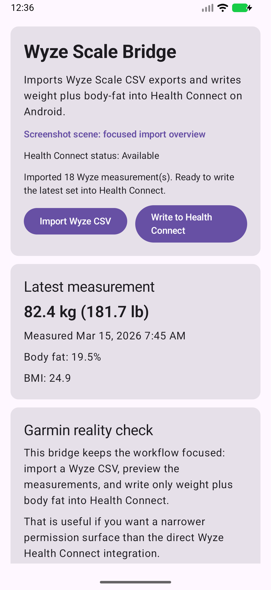
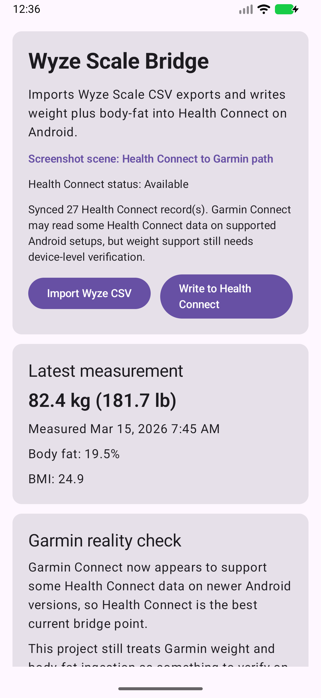

# Wyze Scale Bridge

Android starter app that imports a Wyze Scale CSV export and writes the measurements into Android Health Connect.

## Screen Captures

Focused import and sync flow:

How the Health Connect bridge fits with Garmin:

These are live emulator screenshots generated from the app itself with:

`.\scripts\capture_live_screens.ps1`

Detailed setup and usage guide:

- [Setup And Usage](C:\Users\xliup\OneDrive\Documents\codex\weights\docs\SETUP_AND_USAGE.md)
- [Quick Start](C:\Users\xliup\OneDrive\Documents\codex\weights\docs\QUICK_START.md)
- [Release Metadata](C:\Users\xliup\OneDrive\Documents\codex\weights\docs\RELEASE.md)

## What it does

- Imports Wyze Scale export files from the Wyze app.
- Parses weight and body-fat measurements.
- Writes those records into Health Connect on Android 9+.
- Shows the latest imported measurements in a simple Compose UI.

## Garmin note

This app still does not push data directly into Garmin Connect.

However, Garmin Connect now appears to support some Health Connect data on newer Android versions, so the practical bridge may now be:

Wyze export -> Android app -> Health Connect -> Garmin Connect

Current caveat:

- I have evidence that Garmin Connect supports Health Connect in general, but I have not verified from Garmin documentation that `weight` and `body fat` are included in the Garmin-supported Health Connect data types.
- Garmin's direct public APIs are still partner-oriented rather than a normal consumer import API for this app.

## Why This App Exists If Wyze Supports Health Connect

Wyze can write to Health Connect directly, but it currently insists on requesting a broad range of Health Connect permissions instead of a narrow weight-focused set.

This app is meant to be a more limited bridge:

- import only Wyze Scale CSV data
- request only the Health Connect permissions needed for weight and body-fat writes
- keep the sync scope easier to understand and audit

## Build

1. Open the folder in Android Studio.
2. Let Gradle sync.
3. Run the `app` configuration on an Android 9+ device.
4. Import a CSV exported from Wyze Scale.
5. Grant Health Connect permission when prompted.
6. Tap `Write to Health Connect`.

## Release

- Current release name: `Wyze Scale Bridge 1.0.0`
- Changelog: [CHANGELOG.md](C:\Users\xliup\OneDrive\Documents\codex\weights\CHANGELOG.md)
- Release metadata: [RELEASE.md](C:\Users\xliup\OneDrive\Documents\codex\weights\docs\RELEASE.md)

## Local helper scripts

- Full test runner:
  `.\scripts\run_full_test.ps1`
- Phone install runner:
  `.\scripts\install_debug_apk.ps1`

## Realistic next steps if you want Garmin anyway

1. Test whether your Garmin Connect app now reads the imported Health Connect weight data on your Android device.
2. If Garmin does not read it, try an unofficial Garmin Connect private API login flow.
3. Build a server-side integration if you can get access to Garmin's partner program.

## Sources used for scope decisions

- Wyze says scale data can be exported from the app: [Wyze export article](https://support.wyze.com/hc/en-us/articles/360042271292-Can-I-export-my-Wyze-Scale-data)
- Wyze says scale data can sync with Google Fit: [Wyze Google Fit article](https://support.wyze.com/hc/en-us/articles/360039174572-How-do-I-sync-the-Wyze-app-with-Google-Fit)
- Android Health Connect getting started: [Android Developers](https://developer.android.com/health-and-fitness/guides/health-connect/develop/get-started)
- Health Connect data types and permissions: [Android Developers](https://developer.android.com/health-and-fitness/health-connect/data-types)
- Android newsletter noting Garmin Connect Health Connect support: [Android Developers newsletter](https://developer.android.com/health-and-fitness/community/newsletters/2025/08)
- Garmin Connect Developer Program overview and partner-style access: [Garmin Training API](https://developer.garmin.com/gc-developer-program/training-api/)
- Garmin support on third-party forwarding limits: [Garmin support article](https://support.garmin.com/en-IN/?faq=glJyCFNknq1gbFIL4MBGn6)
